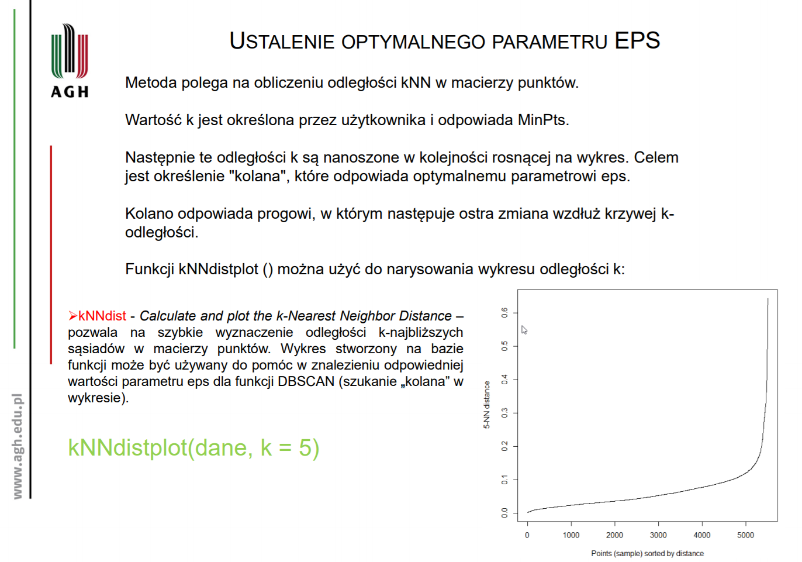

This is an [R Markdown](http://rmarkdown.rstudio.com) Notebook. When you execute code within the notebook, the results appear beneath the code. 

Try executing this chunk by clicking the *Run* button within the chunk or by placing your cursor inside it and pressing *Ctrl+Shift+Enter*. 


Add a new chunk by clicking the *Insert Chunk* button on the toolbar or by pressing *Ctrl+Alt+I*.

When you save the notebook, an HTML file containing the code and output will be saved alongside it (click the *Preview* button or press *Ctrl+Shift+K* to preview the HTML file).

The preview shows you a rendered HTML copy of the contents of the editor. Consequently, unlike *Knit*, *Preview* does not run any R code chunks. Instead, the output of the chunk when it was last run in the editor is displayed.

```{r}
library(tidyverse) # metapackage of all tidyverse packages
library(tokenizers)
library(stopwords)
library(tm)
library(text2vec)
```

```{r}
library(NbClust)
library(cluster)
library(factoextra)
library(dbscan)
```

# Wczytanie i przetworzenie danych


```{r}
data = read.csv("mbti_1.csv")

n <- 1000 #sample from data

data <- data[sample(nrow(data), n), ]
```
```{r}
INTJ <- data[data$type=="INTJ",]
INTP <- data[data$type=="INTP",]
ENTJ <- data[data$type=="ENTJ",]
ENTP <- data[data$type=="ENTP",]
INFJ <- data[data$type=="INFJ",]
INFP <- data[data$type=="INFP",]
ENFJ <- data[data$type=="ENFJ",]
ENFP <- data[data$type=="ENFP",]
ISTJ <- data[data$type=="ISTJ",]
ISFJ <- data[data$type=="ISFJ",]
ESTJ <- data[data$type=="ESTJ",]
ESFJ <- data[data$type=="ESFJ",]
ISTP <- data[data$type=="ISTP",]
ISFP <- data[data$type=="ISFP",]
ESTP <- data[data$type=="ESTP",]
ESFP <- data[data$type=="ESFP",]

```
```{r}
#replaces URLs with word "link"
data$posts <- gsub('http[s]?://(?:[a-zA-Z]|[0-9]|[$-_@.&+]|(?:%[0-9a-fA-F][0-9a-fA-F]))+', 'link', data$posts)

#removes all noise from text
data$posts <- gsub('[^a-zA-Z]', " ", data$posts)

#removes more than 1 space
data$posts <- gsub('[ ]{2,}', " ", data$posts)

#word tokenization and stemming
data$posts <- tokenize_word_stems(data$posts, stopwords = stopwords::stopwords("en"))

```

```{r}
#create dictionary
iterator = itoken(data$posts)
vocab = create_vocabulary(iterator)
pruned_vocab = prune_vocabulary(vocab, 
                                 term_count_min = 5, 
                                 doc_proportion_max = 0.7,
                                 doc_proportion_min = 0.1)
pruned_vocab
```

## Wektoryzacja

```{r}
#document term matrix
vectorizer = vocab_vectorizer(pruned_vocab)
dtm = create_dtm(iterator, vectorizer)

#(Term Co-occurrence Matrix)
tcm = create_tcm(iterator, vectorizer, skip_grams_window = 5L)

#tf_idf
tf_idf = TfIdf$new()
# fit tf-idf to training data
dt_tfidf = fit_transform(dtm, tf_idf)

# apply pre-trained tf-idf transformation to testing data
#doc_term_test_tfidf  = transform(doc_term_test, tf_idf)

vectors.dtm <- dtm
vectors.tfidf <- dt_tfidf
dim(dtm)
```

```{r}
##########
# glove #
##########

glove = GlobalVectors$new(rank = 50, x_max = 10)
wv_main = glove$fit_transform(tcm, n_iter = 100, convergence_tol = 0.01, n_threads = 8)


wv_context = glove$components
word_vectors = wv_main + t(wv_context)
#wv = glove$get_word_vectors()
#dim(wv)
#wv


#If your goal is to classify documents - I doubt any doc2vec approach will beat bag-of-words/ngrams. 
#If you still want to try - common simple strategy short documents (< 20 words) is to represent document as weighted sum/average of word vectors.
#test= word_vectors["link", , drop=F]
#cos_sim_rom = sim2(x = word_vectors, y = test, method = "cosine", norm = "l2")
#head(sort(cos_sim_rom[,1], decreasing = T), 10)

common_terms = intersect(colnames(dtm), rownames(word_vectors) )
dtm_averaged =  normalize(dtm[, common_terms], "l1")
# you can re-weight dtm above with tf-idf instead of "l1" norm
sentence_vectors = dtm_averaged %*% word_vectors[common_terms, ]
vectors.glove <- sentence_vectors
```
```{r}
#split rows into single post not 50 
library(tidyr)
library(dplyr)

data2 = read.csv("mbti_1.csv")
data2 <- data2[sample(nrow(data2), 50), ]# do 200 jakoś idzie

#replaces URLs with word "link"
data2$posts <- gsub('http[s]?://(?:[a-zA-Z]|[0-9]|[$-_@.&+]|(?:%[0-9a-fA-F][0-9a-fA-F]))+', 'link', data2$posts)

data2 <-data2 %>% 
    mutate(posts = strsplit(as.character(posts), "\\|\\|\\|")) %>% 
    unnest(posts)

data2$posts <- gsub('[^a-zA-Z]', " ", data2$posts)

#removes more than 1 space
data2$posts <- gsub('[ ]{2,}', " ", data2$posts)

data2<-subset(data2, sapply(strsplit(posts, " "), length) >=8)

#word tokenization and stemming
data2$posts <- tokenize_word_stems(data2$posts, stopwords = stopwords::stopwords("en"))

#create dictionary
iterator2 = itoken(data2$posts)
vocab2 = create_vocabulary(iterator2)

pruned_vocab2 = prune_vocabulary(vocab2, 
                                 term_count_min = 5, 
                                 doc_proportion_max = 0.8,
                                 doc_proportion_min = 0.001)

#document term matrix
vectorizer2 = vocab_vectorizer(pruned_vocab2)
dtm2 = create_dtm(iterator2, vectorizer2)
#(Term Co-occurrence Matrix)
tcm2 = create_tcm(iterator2, vectorizer2, skip_grams_window = 5L)


glove2 = GlobalVectors$new(rank = 50, x_max = 10)
wv_main2 = glove2$fit_transform(tcm2, n_iter = 100, convergence_tol = 0.01, n_threads = 8)


wv_context2 = glove2$components
word_vectors2 = wv_main2 + t(wv_context2)
#wv = glove$get_word_vectors()
#dim(wv)
#wv


#If your goal is to classify documents - I doubt any doc2vec approach will beat bag-of-words/ngrams. 
#If you still want to try - common simple strategy short documents (< 20 words) is to represent document as weighted sum/average of word vectors.
#test= word_vectors["link", , drop=F]
#cos_sim_rom = sim2(x = word_vectors, y = test, method = "cosine", norm = "l2")
#head(sort(cos_sim_rom[,1], decreasing = T), 10)

common_terms = intersect(colnames(dtm2), rownames(word_vectors2) )
dtm_averaged =  normalize(dtm2[, common_terms], "l1")
# you can re-weight dtm above with tf-idf instead of "l1" norm
sentence_vectors2 = dtm_averaged %*% word_vectors2[common_terms, ]
vectors.glove_post <- sentence_vectors2
```


# Grupowanie

## K-medoids

```{r}
pam.dtm = pam(dtm, 16, metric = "euclidean", stand = FALSE)
pam.tfidf = pam(dt_tfidf, 16, metric = "euclidean", stand = FALSE)
pam.glove = pam(sentence_vectors, 16, metric = "euclidean")
pam.glove2 = pam(sentence_vectors2, 16, metric = "euclidean", stand = FALSE)
```

### K-medoids DTM

```{r}
pam_results_dtm <- data %>%
mutate(cluster = pam.dtm$clustering) %>%
group_by(cluster)

pam_results <- subset(pam_results_dtm, select = c(type, cluster))
t <-  table(pam_results)
print ("Wyniki ilosciowe grupowania dla dtm")
print (t)
t2 <- round(t/rowSums(t)*100)
t2 <- cbind(t2,rowSums(t))
print ("Wyniki procentowe grupowania dla dtm")
print (t2)
fviz_cluster(pam.dtm)
```

### K-medoids TFIDF

```{r}
pam_results_tfidf <- data %>%
mutate(cluster = pam.tfidf$clustering) %>%
group_by(cluster)

pam_results <- subset(pam_results_tfidf, select = c(type, cluster))
t <-  table(pam_results)
print ("Wyniki ilosciowe grupowania dla tf-idf")
print (t)
t2 <- round(t/rowSums(t)*100)
t2 <- cbind(t2,rowSums(t))
print ("Wyniki procentowe grupowania dla tf-idf")
print (t2)

fviz_cluster(pam.tfidf)
```

### K-medoids Glove

```{r}
pam_results_glove <- data %>%
mutate(cluster = pam.glove$clustering) %>%
group_by(cluster)

pam_results <- subset(pam_results_glove, select = c(type, cluster))
t <-  table(pam_results)
print ("Wyniki ilosciowe grupowania dla glove1")
print (t)
t2 <- round(t/rowSums(t)*100)
t2 <- cbind(t2,rowSums(t))
print ("Wyniki procentowe grupowania dla glove1")
print (t2)

fviz_cluster(pam.glove)
```


### K-medoids Glove(oddzielne posty)


```{r}
pam_results_glove2 <- data2 %>%
mutate(cluster = pam.glove2$clustering) %>%
group_by(cluster)

pam_results <- subset(pam_results_glove2, select = c(type, cluster))
t <-  table(pam_results)
print ("Wyniki ilosciowe grupowania dla glove2")
print (t)
t2 <- round(t/rowSums(t)*100)
t2 <- cbind(t2,rowSums(t))
print ("Wyniki procentowe grupowania dla glove2")
print (t2)

fviz_cluster(pam.glove2)
```

## DBSCAN

```{r}
# metric = "euclidean", "manhattan", "gower"
dissimilarity.dtm <- daisy(as.matrix(vectors.dtm), metric = "euclidean")
dissimilarity.tfidf <- daisy(as.matrix(vectors.tfidf), metric = "euclidean")
dissimilarity.glove <- daisy(as.matrix(vectors.glove), metric = "euclidean")
dissimilarity.glove_post <- daisy(as.matrix(vectors.glove_post), metric = "euclidean")
```



```{r}
plot_desity <- function(desity, dissimilarity, method) {
  points <- cmdscale(dissimilarity, k = 2)
  plot(points,
     main = method,
     col = as.factor(desity$cluster),
     mai = c(0, 0, 0, 0),
     mar = c(0, 0, 0, 0),
     xaxt = 'n', yaxt = 'n',
     xlab = '', ylab = '')
}
```

### DTM

Należy odczytać gdzie na wykresie jest tak zwanne kolano, czyli punkt, po którym wykres zaczyna ustawiać się w pionie. Wartość tego punktu zostaje zastosowana jako eps.
```{r}
kNNdistplot(vectors.dtm, k = 5)

```

```{r}
eps = 30
dbscan.dtm <- dbscan(vectors.dtm, eps = eps, minPts = 5)
dbscan.dtm
plot_desity(dbscan.dtm, dissimilarity.dtm, "DTM")
```

### TFID


```{r}
kNNdistplot(vectors.tfidf, k = 5)

```

```{r}
eps = 0.15
dbscan.tfidf <- dbscan(vectors.tfidf, eps = eps, minPts = 5)
dbscan.tfidf
plot_desity(dbscan.tfidf, dissimilarity.tfidf, "TFIDF")
```


### GLOVE


```{r}
kNNdistplot(vectors.glove, k = 5)
```


```{r}
eps = 0.5
minPts = 5
dbscan.glove <- dbscan(vectors.glove, eps = eps, minPts = minPts)
dbscan.glove
plot_desity(dbscan.glove, dissimilarity.glove, "GLOVE")
```

### GLOVE POST


```{r}
kNNdistplot(vectors.glove_post, k = 5)
```


```{r}
eps = 1.5
minPts = 5
dbscan.glove_post <- dbscan(vectors.glove, eps = eps, minPts = minPts)
dbscan.glove_post
plot_desity(dbscan.glove_post, dissimilarity.glove_post, "GLOVE POST")
```


## Grupowanie Hierarchiczne


```{r}
plot_hirarchical <- function(dissimilarity, hirarchical_result, method) {
  points <- cmdscale(dissimilarity, k = 2)
  res.hier <- cutree(hirarchical_result, k = 16)
  plot(points,
       main = method,
       col = res.hier,
       mai = c(0, 0, 0, 0),
       mar = c(0, 0, 0, 0),
       xaxt = 'n', yaxt = 'n',
       xlab = '', ylab = '')
}

```
### DTM

```{r}
# methods = "ward.D", "ward.D2", "single", "complete", "average", "mcquitty", "median", "centroid" 
hc.dtm <- hclust(dissimilarity.dtm, method="ward.D2")
plot(hc.dtm, hang = -1)
rect.hclust(hc.dtm, k=16, border="red")
```

```{r}
plot_hirarchical(dissimilarity.dtm, hc.dtm, "DTM")
```

### TfIDF

```{r}
hc.tfidf <- hclust(dissimilarity.tfidf, method="ward.D2")
plot(hc.tfidf, hang = -1)
rect.hclust(hc.tfidf, k=16, border="red")
```

```{r}
plot_hirarchical(dissimilarity.tfidf, hc.tfidf, "TFIDF")
```

### GLOVE

```{r}
hc.glove <- hclust(dissimilarity.glove, method="ward.D2")
plot(hc.glove, hang = -1)
rect.hclust(hc.glove, k=16, border="red")


```

```{r}
plot_hirarchical(dissimilarity.glove, hc.glove, "GLOVE")
```

### GLOVE Posts

```{r}
hc.glove_post <- hclust(dissimilarity.glove_post, method="ward.D2")
plot(hc.glove_post, hang = -1)
rect.hclust(hc.glove_post, k=16, border="red")

```

```{r}
plot_hirarchical(dissimilarity.glove_post, hc.glove_post, "GLOVE POSTS")
```
